# ABPA3 – Agent-Based Productivity Planner
> A local-first, agent-driven productivity workspace designed to turn thoughts into structured action.

---

<!-- ===================================================== -->
<!-- 🎥 DEMO VIDEO                                          -->
<!-- ===================================================== -->

## 🎥 Checkout ABPA3

<div align="center">

https://github.com/user-attachments/assets/3a09838b-e2f4-4a22-b2df-0033e2720c1e

<br/>
<em>ABPA3 in action: from visual thinking to voice-driven automation</em>

</div>

<br/>

---

## ✨ What is ABPA3?

ABPA3 is an experimental productivity system built around **agent-based automation** and **visual-first thinking**.

Instead of juggling disconnected tools, ABPA3 brings together:
- Visual flowcharts for thinking
- Kanban boards for execution
- Calendar-aware actions
- A fully local voice assistant

All inside a single, cohesive workspace.

### ⏱ Focused Build Time


---

## ❗Read files from "documentation" folder

Documentation has:
- All the theory
- Encountered errors
- Handled solutions

---

## ❗❗Agent workflows & explanation in "n8n_workflows" folder

Images have:
- All workflows
- Settings for certains workflows
- System prompts.

---

## 🧠 From Thought → Action

The interface is designed as a **natural progression** of how work actually happens.

---

## 🟢 1. Think — Capture & Orient

<p align="center">
  
</p>

### Landing Page

*A calm, minimal entry point that orients you inside your productivity space.*

- Reduces cognitive overload
- Surfaces only what matters now
- Acts as the starting point for all workflows

---

<p align="center">
  
</p>

### Changeable Background

*Dynamic backgrounds that adapt to focus, time, and working context.*

- Helps set mental state
- Visually separates modes of work
- Keeps the workspace from feeling static

---

<hr/>

## 🟡 2. Plan — Structure the Work

<p align="center">
  
</p>

### Expanded Kanban

*A full-scale Kanban board for planning and tracking execution.*

- Clear task states
- Visual progress tracking
- Designed for deep, uninterrupted work

---

<p align="center">
  
</p>

### Flowchart → Kanban

*Convert visual thinking directly into scheduled actions.*

- Flowcharts aren't just diagrams
- Decisions become calendar events
- Planning turns into commitment

---

<hr/>

## 🔵 3. Act — Speak & Automate

<p align="center">
  
</p>

### Local Voice Assistant

*A fully local, low-latency voice assistant integrated into the system.*

- No cloud dependency
- Fast, private, and predictable
- Designed for frequent, natural use

---

<p align="center">
  
</p>

### Voice Notes

*Spoken thoughts captured as structured, interactive cards.*

- Think out loud
- Automatically organized
- Easy to refine later

---

<p align="center">
  
</p>

### Voice → Mail

*Turn voice notes into ready-to-send emails instantly.*

- Removes friction from communication
- Keeps context intact
- Saves time on repetitive writing

---

## 🧠 Non-Obvious Technical Concepts Used

| Concept | Where It Appears | Why It’s Non-Obvious |
|------|----------------|----------------------|
| **Real-Time Audio Signal Sampling** | `useAudioLevel` | Continuously sampling microphone amplitude and mapping it to UI feedback crosses into digital signal processing |
| **RMS-Based Temporal Smoothing** | Voice orb / mic intensity | Stabilizes noisy audio signals and matches human loudness perception |
| **EXIF-Aware Media Normalization** | Image → PDF pipeline | Prevents subtle rotation bugs in media pipelines |
| **Proxy Server Architecture** | Image proxy service | Requires backend mediation to respect browser security boundaries |
| **AWS S3 CORS Constraint Handling** | External image loading | Cannot be solved purely on the frontend |
| **Proxy-Mediated Asset Fetching** | Frontend ↔ backend boundary | Enables secure access to restricted resources |
| **Local-First STT & TTS Architecture** | Whisper.cpp, Piper TTS | Prioritizes privacy, determinism, and latency |
| **Agent Responsibility Isolation** | n8n agents | Avoids monolithic AI logic |
| **Event-Driven UI Synchronization** | Voice + Kanban | Real-time updates without polling |
| **Inter Component Communication** | Voice ↔ Kanban | Components act as security and abstraction layers |
| **Natural Ordering Algorithms** | Media batching | Prevents lexicographic ordering bugs |
| **UI as a Signal Consumer** | Voice visualization | UI reacts to real-world signals |
| **Constraint-Driven UX Design** | Offline-first, CORS | UX shaped by platform limits |

---

## 🧭 System Architecture (Graphical Overview)

> A high-level view of how **frontend modules**, **backend services**, and **automation agents** interact inside ABPA3.

```mermaid
flowchart TB

subgraph Backend["Backend (Local)"]
    PY["Python / Node.js Server<br/>(Port 5002)<br/>STT / TTS"]
    OPT["OPTIONS API"]
    N8N["n8n Localhost<br/>(Port 5678)"]
    WH["Webhooks"]
    IMG_PROXY["Image Proxy"]
end

subgraph Frontend["Frontend (React – Port 3000)"]
    REACT["React App"]
    STORAGE["Browser Local Storage"]
end

CR["Client Request Hub"]

PY <--> OPT
OPT <--> CR
CR <--> WH
WH <--> N8N

REACT <--> STORAGE
REACT <--> CR

CR --> IMG_PROXY

subgraph UI["Frontend Modules"]
    FC["Flow Canvas"]
    VA["Voice Assistant"]
    VN["Voice Notes"]
    TW["Time Widget"]
    CK["Custom Kanban"]
end

FC <--> CR
VA <--> CR
VN <--> CR
TW <--> CR
CK <--> CR

VN <--> TW

subgraph Output["Productivity & Automation"]
    UP["Upcoming Panel"]
    MF["Mail to Faculty"]
    TT["Task Tracker"]
end

UP <--> MF
VA --> UP
CK --> TT
```


---

## ▶️ How to Run ABPA3 Locally

### 1. Install Dependencies
Follow instructions inside:
```
install_dependencies.txt
```

### 2. Clone the Repository
```
git clone https://github.com/chishtil1730/ABPA3-AgentBased-Productivity-Planner.git
cd ABPA3-AgentBased-Productivity-Planner
```

### 3. Start Services

**Python Server**

use the server.py file from server_docs and run it directly or<br>
with this command in terminal.

```
python server.py
```

**React App**
```
npm install
npm start
```

**Image Proxy**
```
node server.js
```

Open http://localhost:3000

<hr/>

## 🔁 4. Reflect — Stay in Control

ABPA3 is designed to **close the loop**:
- Thoughts become plans
- Plans become actions
- Actions leave artifacts you can review and refine

The system supports **iteration**, not perfection.

---

## 🧠 Core Philosophy

- 🧩 Agent-based automation over monolithic tools  
- 🔒 Local-first, privacy-respecting design  
- ⚡ Low-latency interactions  
- 🎯 Visual clarity over feature overload  

ABPA3 treats productivity as a **system**, not a checklist.

---

## 🚧 Project Status

This project is under active development.  
UI previews represent evolving, experimental features and internal tooling.

---

## 📌 Notes

- This repository is intentionally **read-only**
- Forks and pull requests are welcome
- Direct pushes are disabled by design

---


