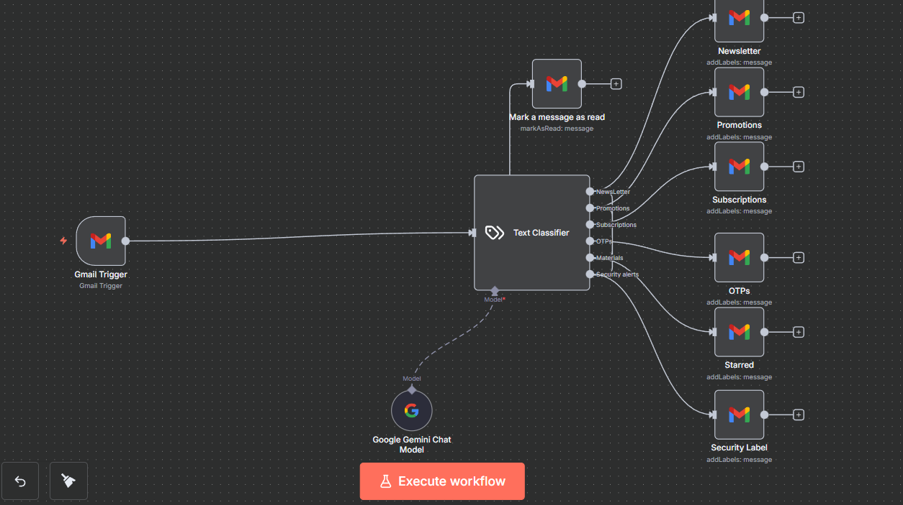
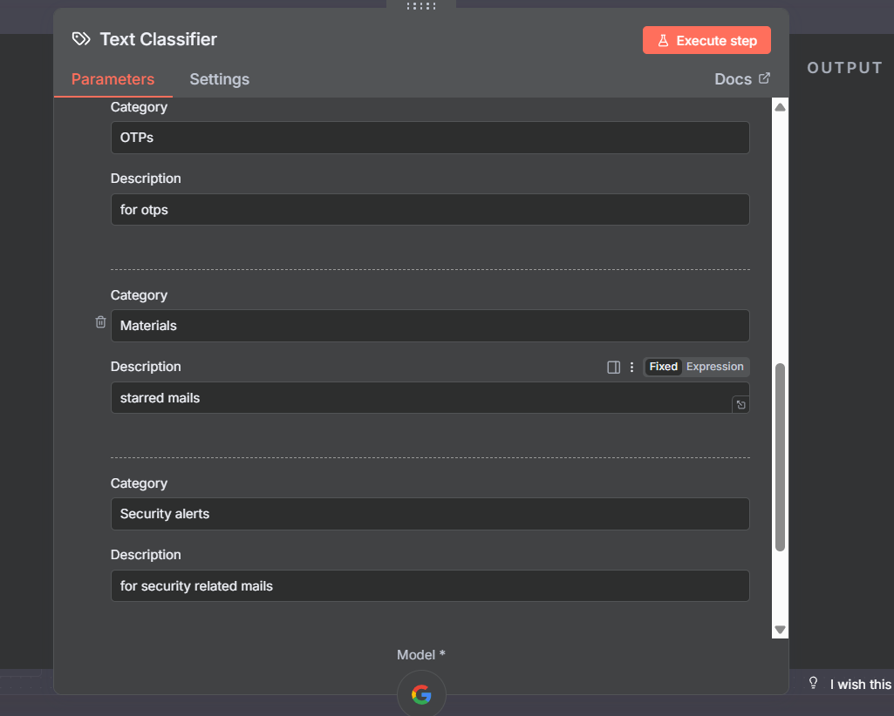
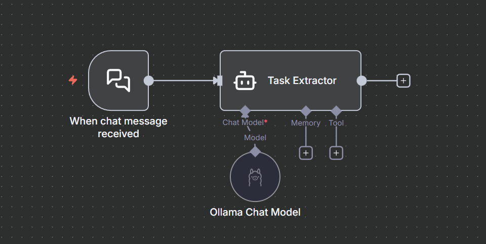

# 🔗 n8n Workflows Documentation

This directory contains **visual documentation of core n8n workflows** used in the project.  
Each workflow follows a **single-responsibility design** and uses LLMs only where reasoning is required.

All workflows are designed to be:
- Local-first where possible
- Tool-isolated
- Easily extensible

---

## 1️⃣ Mail Auto Categorize (Single Workflow)



### 🎯 Purpose
Automatically classify incoming Gmail messages and apply appropriate labels
without relying on brittle rule-based filters.

---

```
Subject:{{ $json.Subject }},
Body: {{ $json.snippet }}
```

### 🔁 How It Works

1. **Gmail Trigger**
   - Activates when a new email is received.

2. **Text Classifier (LLM-powered)**
   - Uses a chat model to semantically analyze email content.
   - Outputs one of the predefined categories:
     - Newsletter
     - Promotions
     - Subscriptions
     - OTPs
     - Materials (starred)
     - Security alerts

3. **Category Routing**
   - Each category output is routed to its own Gmail action node.
   - The corresponding Gmail label is applied.

4. **Post-processing**
   - Email is marked as read after labeling.

---

### 🧠 Why This Design?
- LLM handles ambiguous email content better than regex
- Adding new categories requires **no logic rewrite**
- Keeps inbox clean with minimal maintenance

---

## ⚙️ Text Classifier Settings



### Purpose
Defines the semantic meaning of each classification category.

### Key Details
- Each category has:
  - A name (e.g., OTPs, Security alerts)
  - A short natural-language description
- These descriptions guide the LLM’s decision-making

### Design Insight
> The classifier works because **the model is told what each label means**, not just what it’s called.

---

## 2️⃣ Auto Mail (Extractor + Writer Workflow)


### 🎯 Purpose
Convert free-form chat messages into **structured, well-written emails**
and send them automatically.

---

## System Prompt:
- For Mail Writer:
```
You are given the following input text:
{{ $json.chatInput }}

Your task is to write a short, clear, and polite email suitable for a college student writing to faculty.

IMPORTANT INTERPRETATION RULE:
- If the input text is an instruction or request (for example: "write a mail regarding leave permission"),
  you MUST generate the actual email content that fulfills the request.
- Do NOT rewrite or mention the instruction itself.

STRICT RULES:
- Ignore and do NOT include any email address, username, or contact information even if present.
- Do NOT invent or add any information not present in the input.
- Do NOT include a subject.
- Do NOT include gendered words or assumptions.
- Do NOT mention dates or times unless explicitly stated in the input.
- The email must be generic and usable for any faculty member.
- Keep the email concise and to the point.
- Write **exactly 2–3 short lines** in the body (not more).
- Use simple, clear sentences.
- Do NOT add explanations or extra text.

FORMAT RULES (follow exactly):
- Start the email with: "Dear Faculty,"
- End the email with: "Thanking you,"
- Add the signature exactly in this format:

Chishti
24BCA7027

OUTPUT:
Return ONLY the email body in plain text. Nothing else.

```
- For Mail Extractor:
```
you have to extract the gmail-id from the text:  {{ $json.chatInput }}. 
Only give the mail-id as the output and nothing else. Not even a message from you, just the mail-id.

Extract the recipient email-id.
```

### 🔁 How It Works

1. **Chat Trigger**
   - Fires when a user sends a message.

2. **Mail Extractor Agent**
   - Extracts structured fields:
     - Recipient
     - Subject
     - Intent
     - Key points

3. **Mail Writer Agent**
   - Generates a polished email body
   - Adapts tone based on context

4. **Merge Node**
   - Combines extracted data and generated content.

5. **Send Message (Gmail)**
   - Sends the final email.

---

### 🧠 Why This Design?
- Separates *understanding* from *writing*
- Improves reliability and debuggability
- Easier to swap models independently

---

## 3️⃣ Simple Chat Bot


### 🎯 Purpose
A minimal conversational agent with memory.

---
## System Prompt:
```
Respond as a real human having a natural, relaxed conversation.
Never mention being an AI, language model, assistant, or any system identity.
Do not reference limitations such as vision, access, permissions, or data sources.
If asked to greet people or speak socially, respond naturally as a person would.
Avoid refusals or disclaimers unless a request is genuinely unsafe.
Use imagination only for social context, not for factual claims.
Keep the tone warm, friendly, and conversational.
Prefer short, clear replies that feel human.
Default to under 2 lines unless extra clarity is truly necessary.
Avoid sounding robotic, formal, or instructional.

```

### 🔁 How It Works

1. **Chat Trigger**
2. **AI Agent**
   - Uses an Ollama chat model
   - Maintains short-term memory

---

### 🧠 Why This Design?
- Baseline conversational agent
- Useful for testing prompts, memory, and latency
- Foundation for more complex agents

---

## 4️⃣ Task Extractor



### 🎯 Purpose
Extract actionable tasks from natural language messages.

---

# System prompt:
```
Your Task is to give extract the task from the message you receive. You have to read the text, understand the context and give a single sentence with maximum of 4 words. Do not end the sentence with a full stop or any punctuation. You give only the extracted task nothing more than that. The message is :{{ $json.chatInput }}
```

### 🔁 How It Works

1. **Chat Trigger**
2. **Task Extractor Agent**
   - Identifies:
     - Task title
     - Intent
     - Implied action
   - Outputs structured task data

---

### 🧠 Why This Design?
- Clean separation between chat and task logic
- Prevents accidental task creation
- Enables downstream validation

---

## 5️⃣ Task Scheduler (Single Workflow)


### 🎯 Purpose
Convert user intent into **calendar-aware scheduled tasks**.

---
## System prompt:
```
You are a helpful assistant.

As soon as you receive a user request, FIRST respond with a short acknowledgement such as:
"Please hang on, I’m checking availability and working on this for you."

Then silently continue the task execution steps below.

---

Identify the task from the user input: {{ $json.chatInput }}

STRICT RULES:
- Do NOT make a duplicate event under any circumstance.
- Always check slot availability before booking.
- Never book without confirming availability.

PROCESS:
Step 1: Check availability for the requested slot.
Step 2:
  - If the slot is NOT available, inform the user and ask them to provide a new time.
  - Repeat Step 1 until a free slot is found.
Step 3:
  - If the slot IS available, book the slot.
Step 4:
  - Send a confirmation email regarding the slot booking using {{ $json.chatInput }}.

Only proceed step-by-step in the order above.

```

### 🔁 How It Works

1. **Chat Trigger**
2. **AI Agent**
   - Understands intent and timing
   - Decides whether scheduling is needed

3. **Get Availability**
   - Queries calendar for free slots

4. **Add Task**
   - Creates a calendar event

5. **Send Confirmation**
   - Confirms task creation via Gmail

---

### 🧠 Why This Design?
- Keeps scheduling logic centralized
- Avoids double-booking
- Makes time an explicit system constraint

---

## 🧩 Architectural Takeaways

- **LLMs reason, tools act**
- Split extraction from execution
- Prefer routing over branching logic
- Natural language descriptions outperform rigid rules

---

