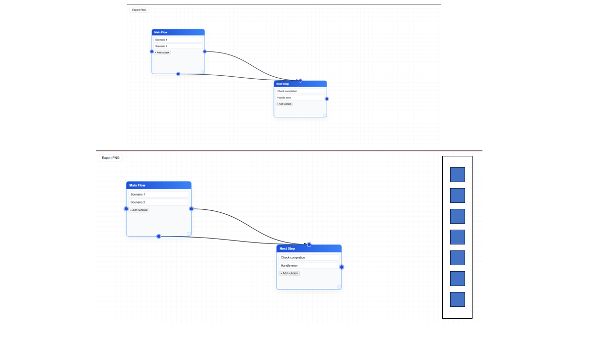
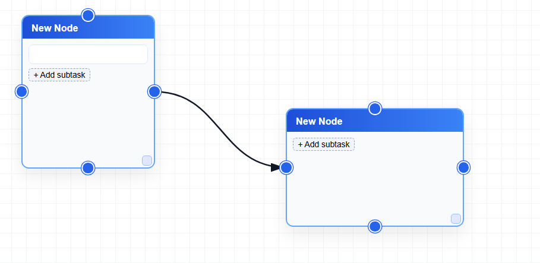
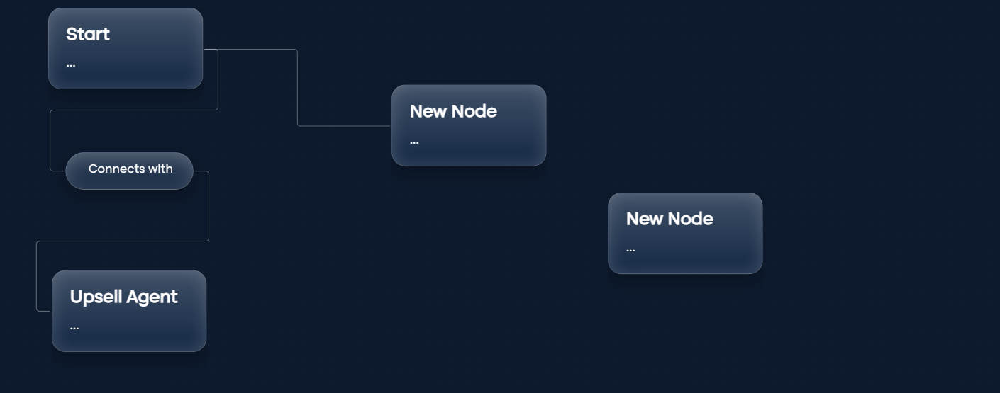
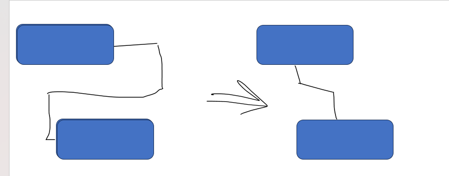
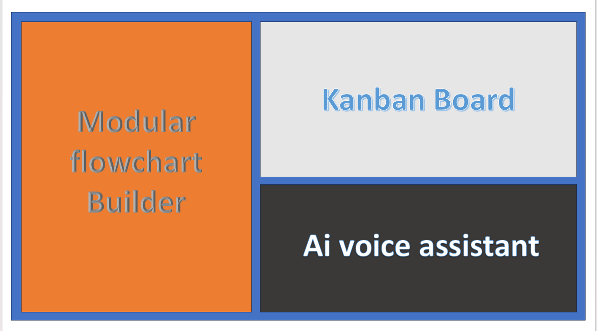
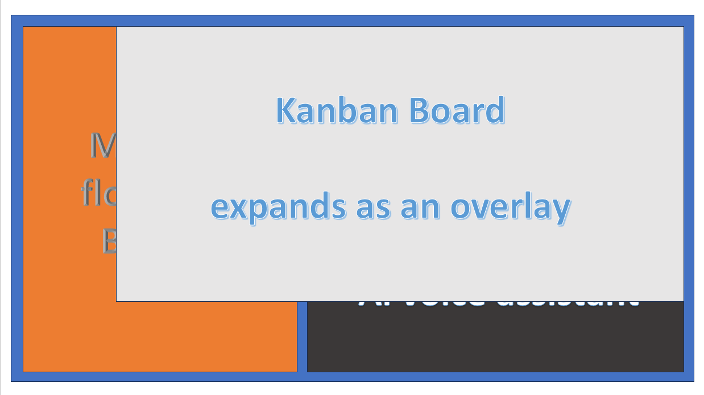
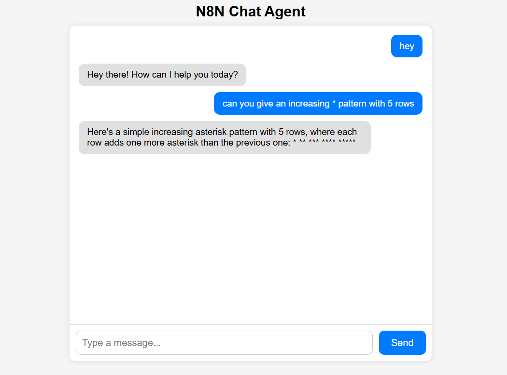

## Flowchart Prototypes

### flowchart_prot1.1.png
Early flowchart concept exploring the initial structure and navigation logic of the system.

  

---

### flowchart_prot1.2.png
Iteration on the first flowchart with refinements to node grouping and transitions.

  

---

### flowchart_prot2.png
Second-generation flowchart prototype focusing on clearer decision paths and modular flows.

  

---

### flowchart_prot3.png
More polished flowchart version representing near-final interaction and process logic.

  

---

## General UI Prototypes

### prot1.png
Initial UI layout prototype showcasing overall component placement and hierarchy.

  

---

### prot2.png
Refined UI prototype with improved spacing, alignment, and visual balance.

  

---

## Voice Assistant Prototype

### voice_assistant_prot1.png
Concept design for the AI voice assistant interface, focusing on interaction flow and user feedback states.

  

